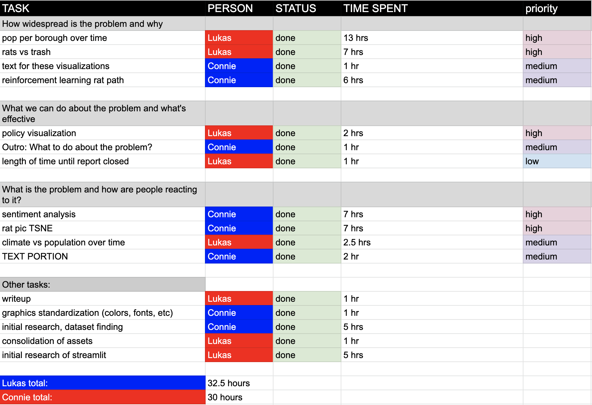
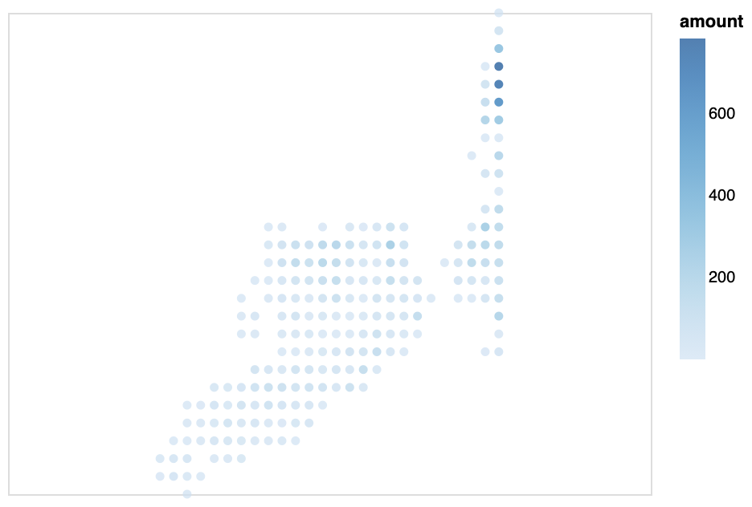
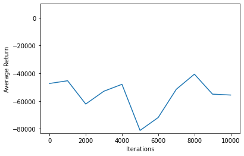

# A3

# Aww Rats!🐀

New York has a unique relationship with rats. Rodents have become a symbol of the city as much as the Empire State Building or the Status of Liberty. Part of this association is due to New York's very real rodent problem. In this application, we explore data from a variety of sources, including NYC Open Data, Wikipedia, and Reddit to get a better understanding New York's unique relationship with rats, and what they are doing about it.

## Project Goals

Overall, this application answers the question: **What Is The Rat Problem In New York**? There are several different aspects that we explore in the application to allow greater understand. Through the rat sightings reports (via 311), we are able to explore:

- Which areas have the most rat sightings?
- How do these sightings change over time?

We further explore through budget data:

- How did policy affect the rat population?
- Which policies were effective?

We also explore how New Yorkers actually feel about rats via sentiment analysis on Reddit posts. This answers the questions:

- How do New Yorkers generally respond to rats
- What are rats doing during these sightings?

## Design

Exploring the locations of rat sightings and inspections is inherently spatial. We could have used a bar chart binned by borough, but that ignores centralization of sightings to regions within a borough. Furthermore, to increase granularity to something like tracts within boroughs would be too much information for a non geospatial chart. Therefore, we used a map of the sighting coordinates to represent reports. The opacity is lowered on the dots representing the reports so as to allow the reports to form a heat-map which shows density.

The population over time could similarly be binned by year and represented as a bar chart. However, aside from inherent relationship of population and time that can be graphed with a line, the time as an "x" value also allows brushing so as to answer the question of how time effects population when combined with the map above.

The Department of Health budget could be represented in several ways, which made decision making trickier. When considering allocation of budget across the sub-departments, we could represent it in ways ranging from a pie chart, tree-map or stacked bar. Unfortunately, there are so many sub divisions that the data becomes noise. Even binned by sub division such that we only color Pest Control or other, pest control is just a sliver. Therefore, we decided to focus on the trends of the budget over time for the Sanitation, Pest Control, and total budget. This helps to understand whether the budget is cutting Sanitation/Pest Control as a general trend, or specific to a time period.

The t-SNE also has an important role in the application. New York is a wildly vertical city, so a point on a map does not convey whether a location is in the subway or an apartment. As such, the groupings offered by the t-SNE allow us to see the general archetypes of locations in which rats are seen. Combined with the comments that appear from Reddit posts which the photos are scraped from, and sentiment analysis, we are able to understand the context in which New Yorkers interact with rats and their general feelings.

## Development

TODO: **An overview of your development process.** Describe how the work was split among the team members. Include a commentary on the development process, including answers to the following questions: Roughly how much time did you spend developing your application (in people-hours)? What aspects took the most time?

We split the work up as so:

Making the application was a long process, involving explorations of several different implementation schemes.

Lukas spent the early phases of the project trying to get a deeper understanding of Streamlit, so that more boutique solutions were available if and when needed (such as styling, special interactions, and performance tips). Connie meanwhile did research into every form of context for the project she could think of. She explored budget, policy, what species are popular, what experts say is causing the rat population to increase, how NYC is dealing with it, and what New Yorkers are saying about the policy and the rats themselves. Connie spent at least five hours alone on research, and Lukas spent comparable time digging through forums to make sure we could work with Streamlit instead of against it.

As Hadley Wickham said: "Tidy datasets are all alike, but every messy dataset is messy in its own way." Lukas initially made some false conclusions about the dataset related to time, as the timestamps conform to the American date format of MM/DD/YYYY as opposed to ISO formatted time. After cleaning that up, he also had to get rid of data points that are somehow in Pennsylvania? The rats data seems to be a subset of the NYC 311 dataset, so some columns that make sense for 311 did not make sense for us, and were dropped.

For the map, Lukas originally tried Streamlit's `st.map()`,but quickly realized he needed more granular control. He found through the documentation that Streamlit's map is actually a wrapper for Pydeck. However, when he tried to input my dataset into a Pydeck constructor, he ended up having unexplained JSON errors. As a backup, Lukas made a map using D3 and Observable, and kept fiddling with Pydeck. Eventually, he came to understand that Pydeck will fail if *any* values inputed are null, so he filtered the data to just non-null latitude/longitude pairs, and it worked...until he tried to filter by year using an `st.slider()`, which resulted in massive reload times. He realized this was an opportunity to take advantage of Vega-Lite's interactive states, and decided to map the data through Altair, then connect a brush to the complaints over time chart. The results were still not as fast as he'd prefer, but far better than the reload time with Streamlit's widgets.

Several charts and implementations didn't make it past the cutting room floor. Connie had read that rats congregate around unsanitary locations, feeding on trash. She also read that the increase in rat population is due to climate change making Summer longer. Lukas attempted several charts to explore this phenomena, including a choropleth map of trash collected in NYC boroughs based on data Connie found. It was hard to make the chart fit well into the narrative directly, so it was axed. As for the weather, Lukas downloaded a historical NYC weather dataset from NOAA ranging ten years. First, the data came as a PDF, so it required a level of munging to convert to a usable format. Another factor we hadn't counted on is that climate change is serious, but occurs over a relatively uniform average in New York, so the average weather evened out. When using a more granular level of data, the chart became noisy when compared to rat complaints, so the chart also didn't make the cut. Lukas also explored making a tree-map, pie chart, and stacked bar representing budget, but these solutions were not idea. The tree map would have changed to jarringly when altered by time, Altair does not yet have `mark_arc()` from what he has seen, so he would have had to embed an Observable widget, and even if so, chart did not seem like the right fit as explained above, and and stacked bar had the same problems as the pie chart.

Connie originally planned to use machine learning to create rat location predictors, so as to plot routes that avoid (or encounter) rats. To avoid having to use actual NYC street path data, she quantized the data to a regularized grid, which had possible use as a cartogram. The routes would then be defined by "up, down, left, right, left and up, etc."

She started by reading about Tensorflow agents and custom reinforcement training environments. She was able to get all of the core tech working and trained an agent to travel from point A, encoded as (x1, y1), to point B, encoded as (x2, y2) on a 10 by 10 grid within 100 steps with a high success rate. However, when she increased the size of the grid to the dimensions of the rat grid, which was roughly 300 by 50, the training took a incredibly long time and didn't look like it would be successful. Here's a graph of the average returns of one training session (10,000 iterations, batch size 64).

